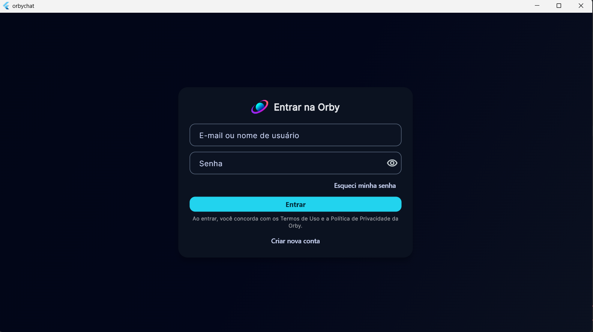
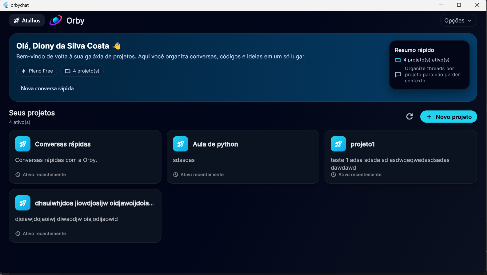

# 🤖 OrbyChat – AI Chat Platform

Full-stack AI chat platform focused on scalable architecture, secure systems, and real-world production design.

This project focuses on building a production-grade backend and system structure for AI-powered conversations.

⚠️ This project is currently in active development.

---

## 🧠 Overview

OrbyChat is designed as a **modern AI chat platform**, combining:

- Scalable backend architecture
- Secure authentication system
- Multi-tenant data structure
- AI-powered conversations

The goal is to simulate a **real-world SaaS platform**, not just a simple chat application.

---

## 🎯 Core Concept

The system is built around structured communication flow:

User → Project → Thread → Messages → AI Processing → Response

This allows:

- Organized conversations
- Context-aware AI responses
- Scalable data modeling
- Multi-user support

---

## 🧠 System Flow

```text
User
 ↓
Authentication Layer
 ↓
API Layer (Cloudflare Workers)
 ↓
Business Logic
 ↓
Database (PostgreSQL)
 ↓
AI Processing (OpenAI)
 ↓
Response
```

---

## 📱 App Preview

### 🔐 Login
<p align="center">
  
</p>

### 🏠 Dashboard
<p align="center">
  
</p>

### 📁 Projects & Threads
<p align="center">
  
</p>

### 💬 Chat Experience
<p align="center">
  
</p>

### 👤 Profile Management
<p align="center">
  
</p>

### 🏆 Gamification System
<p align="center">
  
</p>

### 🤖 AI Personalization
<p align="center">
  
</p>

### 💳 Pricing Plans
<p align="center">
  
</p>

---

## 🚀 Key Features

- 🤖 AI-powered chat system
- 🔐 Secure authentication (token-based)
- 🧩 Multi-project support
- 💬 Thread-based conversations
- 📊 Structured data model
- ⚡ Serverless backend (Cloudflare Workers)
- 🧠 Context-aware AI responses
- 🏆 Gamification system (XP, achievements)
- 🔍 Logging and monitoring

👉 Full details: `docs/FEATURES.md`

---

## 🏗️ Architecture

The system follows a **modular and scalable architecture**:

- **Frontend:** Flutter (planned)
- **Backend:** Cloudflare Workers (serverless)
- **Database:** PostgreSQL
- **AI Layer:** OpenAI API
- **Authentication:** Token-based system
- **Session Management:** Hybrid model (runtime + persistence)

👉 Detailed architecture: `docs/ARCHITECTURE.md`

---

## 🔐 Security

Security is treated as a core system requirement:

- Token-based authentication
- Session persistence and validation
- Secure API communication
- Controlled access to user data
- Structured error handling

⚠️ Some security implementations are intentionally abstracted.

👉 More details: `docs/SECURITY.md`

---

## 🧪 Technical Highlights

- Designed as a **real-world SaaS architecture**
- Serverless backend using **Cloudflare Workers**
- PostgreSQL relational model (User → Project → Thread → Message)
- Token-based authentication with session management
- AI integration with contextual conversation history
- Multi-tenant architecture with project isolation
- Gamification system with XP tracking and achievements
- Scalable API structure ready for production environments

---

## 🧩 Project Structure

```text
orbychat-platform/
├── docs/
│   ├── ARCHITECTURE.md
│   ├── DATABASE.md
│   ├── FEATURES.md
│   ├── ROADMAP.md
│   └── SECURITY.md
└──screenshots/
    ├── 01_login.png
    ├── 02_dashboard.png
    ├── 04_threads.png
    ├── 05_chat.png
    ├── 06_profile.png
    ├── 07_gamification.png
    ├── 08_ai_settings.png
    └── 09_pricing.png 
```

---

## 🗺️ Roadmap
- [x] System architecture design
- [x] Backend structure definition
- [x] Authentication system
- [x] Database modeling
- [ ] AI response optimization
- [ ] Frontend implementation (Flutter)
- [ ] Real-time features
- [ ] Performance improvements
- [ ] Production deployment

👉 Full roadmap: docs/ROADMAP.md

---

## 🚧 Current Status

✅ Architecture defined  
✅ Backend foundation created  
✅ Authentication system implemented  
🚧 AI integration improvements  
🚧 Frontend under development

---

## 🔮 Vision

The long-term goal is to build a scalable AI platform that includes:

- Intelligent conversation systems
- Real-time interaction
- Secure multi-user environments
- Extensible SaaS architecture

---

## 📌 Why This Project

This project highlights the ability to:

- Design complex systems from scratch
- Build scalable backend architectures
- Integrate AI into real-world applications
- Handle authentication and session management
- Structure production-ready software systems

---

## 👨‍💻 Author

Developed by Diony Costa

- LinkedIn: https://www.linkedin.com/in/diony-silva-costa-77b9a3225
- Email: dev.diony.costa@gmail.com

---

## ⚠️ Disclaimer

This repository intentionally omits:

- Full production backend implementation
- Sensitive security logic
- Infrastructure configuration details

This ensures system integrity while maintaining architectural transparency.
